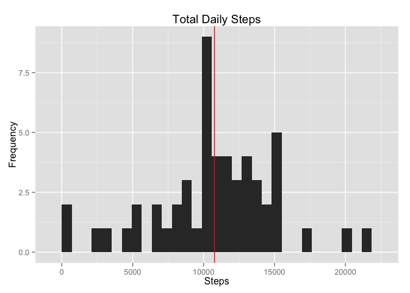
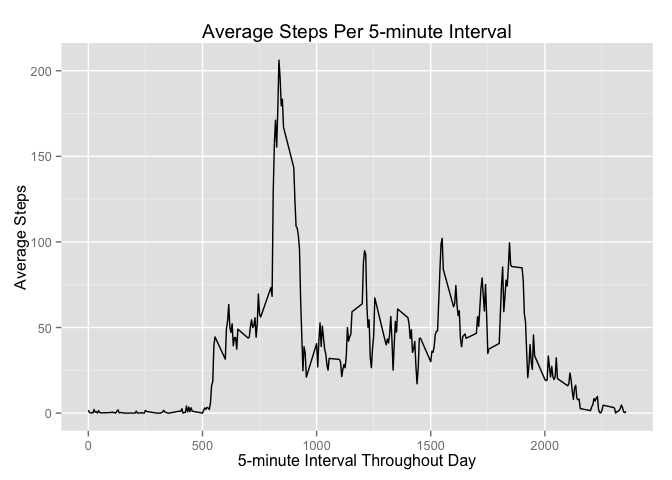
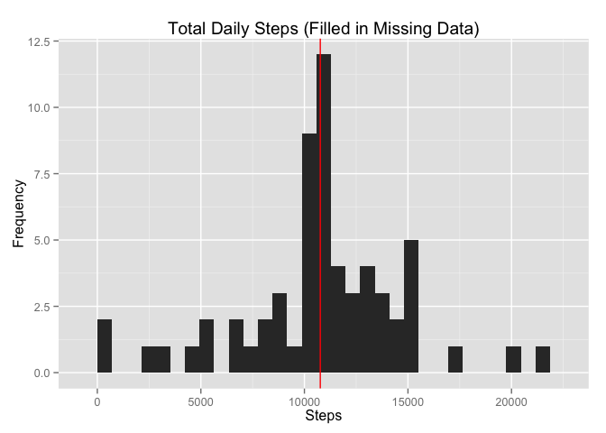
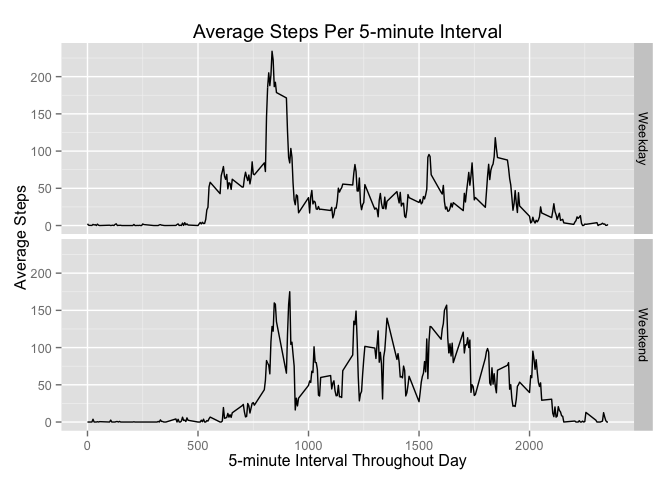

# Reproducible Research: Peer Assessment 1
jkim19  

## Loading and preprocessing the data
(note: activity.csv must be unzipped and in same directory as script to run properly)

(note: this analysis will be using ggplot2 and dplyr and the following also code loads those libraries)

```r
suppressMessages(library(dplyr))
library(ggplot2)

activitydf <- read.csv("activity.csv", header=TRUE, colClasses=c("numeric","Date","numeric"))
```

## What is mean total number of steps taken per day?

Histogram of the total steps per day (Red line is the mean)

```r
stepsbyday <- group_by(select(activitydf,date,steps),date)
totalsbyday <- summarise_each(stepsbyday,funs(sum))

tsbdplot <- qplot(steps,data=totalsbyday,geom="histogram")
tsbdplot <- tsbdplot + ggtitle("Total Daily Steps") + xlab("Steps") + ylab("Frequency")
meansteps <- mean(totalsbyday$steps,na.rm=TRUE)
tsbdplot <- tsbdplot + geom_vline(xintercept=meansteps, color="red")
suppressMessages(print(tsbdplot))
```

 

The mean total number of steps per day

```r
meansteps <- mean(totalsbyday$steps,na.rm=TRUE)
meansteps
```

```
## [1] 10766.19
```

The median total number of steps per day

```r
median(totalsbyday$steps,na.rm=TRUE)
```

```
## [1] 10765
```

## What is the average daily activity pattern?

Let's plot the average steps per 5-minute interval during the day 

```r
stepsbyint <- group_by(select(activitydf,interval,steps),interval)
meanstepsbyint <- summarise_each(stepsbyint,funs(mean(.,na.rm=TRUE)))

msbiplot <- qplot(interval,steps,data=meanstepsbyint,geom="line")
msbiplot <- msbiplot + ggtitle("Average Steps Per 5-minute Interval") + xlab("5-minute Interval Throughout Day") + ylab("Average Steps")
msbiplot
```

 

The 5-minute interval with the highest step count:

```r
orderedbyint <- arrange(meanstepsbyint,desc(steps))
#highest average steps occur during this 5-minute interval
orderedbyint[1,]
```

```
## Source: local data frame [1 x 2]
## 
##   interval    steps
## 1      835 206.1698
```

## Imputing missing values

The total number of missing values in our dataset:

```r
sum(is.na(activitydf$steps))
```

```
## [1] 2304
```

Let's impute the average steps for that particular five minute interval in the missing interval

```r
copydf <- activitydf
avgspi <- sapply(copydf$interval,function(x) filter(meanstepsbyint,interval==x)$steps)
copydf <- cbind(copydf,avgspi)
copydf <- mutate(copydf, modsteps= ifelse(is.na(steps),avgspi,steps))
```

Now, let's chart the total steps per day with filled in data.  And let's examine the mean and median

```r
stepsbyday2 <- group_by(select(copydf,date,modsteps),date)
totalsbyday2 <- summarise_each(stepsbyday2,funs(sum))

tsbdplot2 <- qplot(modsteps,data=totalsbyday2,geom="histogram")
tsbdplot2 <- tsbdplot2 + ggtitle("Total Daily Steps (Filled in Missing Data)") + xlab("Steps") + ylab("Frequency")
meansteps2 <- mean(totalsbyday2$modsteps,na.rm=TRUE)
tsbdplot2 <- tsbdplot2 + geom_vline(xintercept=meansteps2, color="red")
suppressMessages(print(tsbdplot2))
```

 

The updated mean total number of steps per day

```r
meansteps2 <- mean(totalsbyday2$modsteps,na.rm=TRUE)
meansteps2
```

```
## [1] 10766.19
```

The updated median total number of steps per day

```r
median(totalsbyday2$modsteps,na.rm=TRUE)
```

```
## [1] 10766.19
```
It appears that since we filled in the missing data with averages, the actual means stayed the same, but the medians actually moved towards the mean.

## Are there differences in activity patterns between weekdays and weekends?

First, let's create a new column categorizing the day as a Weekend or Weekday

```r
copydf <- mutate(copydf, daycat=ifelse(weekdays(date) %in% c("Saturday","Sunday"),"Weekend","Weekday"))
stepsbydayint <- group_by(select(copydf,daycat,interval,steps),daycat,interval)
meanstepsbydayint <- summarise_each(stepsbydayint,funs(mean(.,na.rm=TRUE)))
```

Now, let's plot the daily activity per day, Weekday vs Weekend

```r
msbdiplot <- qplot(interval,steps,data=meanstepsbydayint,facets=daycat~.,geom="line")
msbdiplot <- msbdiplot + ggtitle("Average Steps Per 5-minute Interval") + xlab("5-minute Interval Throughout Day") + ylab("Average Steps")
msbdiplot
```

 

